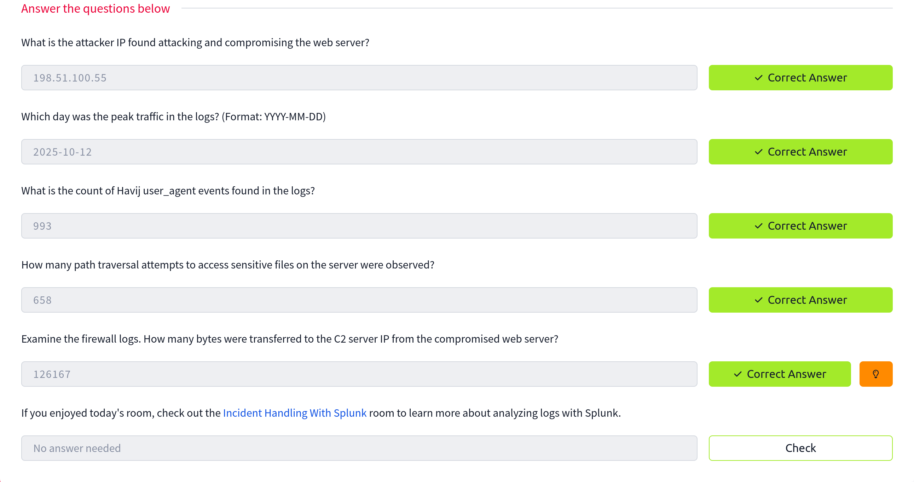

# Splunk Basics - Did you SIEM? 

## Log analysis with Splunk 

Splunk is a platform for collecting, storing, and analysing machine data. It provides various tools for analysing data, including search, correlation, and visualisation. It is a powerful tool that organisations of all sizes can use to improve their IT operations and security posture.

- Followed the walkthrough to get the answers to the questions. 
- Learnt basics of Splunk and its search query language 

