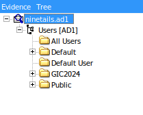
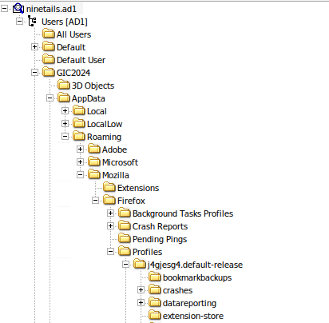
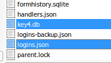

# NineTails 

Description:

Looks like I got a little too clever and hid the flag as a password in Firefox, tucked away like one of NineTails’ many tails. Recover the "logins" and the "key4" and let it guide you to the flag.

Hint:
VI named my Ninetails "j4gjesg4", quite a peculiar name isn't it?

Was provided with a file called `ninetails.ad1`

I looked up what is an `.ad1` file. An AD1 file is a proprietary digital forensics disk image format created by AccessData. 

To view the contents of that file, you need to install an application called `FTK Imager`. I installed that application on my system and opened the provided file using it. 



This is basically a Windows image file. 
The users are shown in the picture above, the most peculiar one here is `GIC2024`. 

According to the description `Recover the "logins" and the "key4" and let it guide you to the flag.`, I researched what this means and this is what I found: 
Passwords are stored in a hash  in `logins.json` and `key4.db` in Firefox. 

On Windows, these files can usually be found in `C:\Users\<YourUsername>\AppData\Roaming\Mozilla\Firefox\Profiles\<random_folder_name>\`

We can crack these hashes to get the passwords for the logins, to get the flag. This can be done using a tool called `firefox_decrypt`

Github: https://github.com/unode/firefox_decrypt

As we can see here `j4gjesg4` is profile, from which, we can get the `logins.json` and `key4.db` files.  



We found both the files in the `j4jesg4.default-release` folder.  



I exported the entire profile, by right-clicking the folder and selecting export files. 

I saved all those files in a folder called `firefox_profile`, which is required for the `firefox_decrypt` tool. 

I used that tool to extract the login passwords using the following command: 

```
(.venv) ➜  ~/Documents/recruitment/haard_phase2/forensics/NineTails/firefox_decrypt git:(main) ✗ python3 firefox_decrypt.py ../firefox_profile
2025-12-05 11:53:12,049 - WARNING - profile.ini not found in ../firefox_profile
2025-12-05 11:53:12,049 - WARNING - Continuing and assuming '../firefox_profile' is a profile location

Website:   https://www.rehack.xyz
Username: 'warlocksmurf'
Password: 'GCTF{m0zarella'

Website:   https://ctftime.org
Username: 'ilovecheese'
Password: 'CHEEEEEEEEEEEEEEEEEEEEEEEEEESE'

Website:   https://www.reddit.com
Username: 'bluelobster'
Password: '_f1ref0x_'

Website:   https://www.facebook.com
Username: 'flag'
Password: 'SIKE'

Website:   https://warlocksmurf.github.io
Username: 'Man I Love Forensics'
Password: 'p4ssw0rd}'
```

flag: `GCTF{m0zarella_f1ref0x_p4ssw0rd}`


