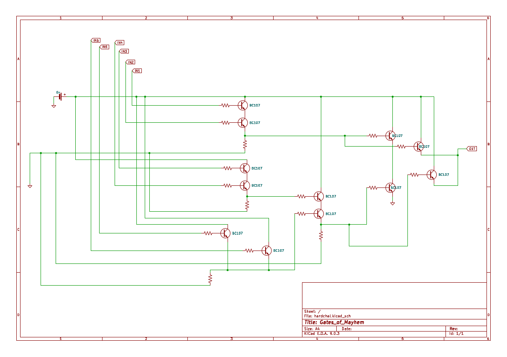

Logic gates using BJTs 
BC107, NPN transistor 
Provided schematic: 


The entire circuit can be boiled down to a single expression: 
`output = (in1 and in2) ^ ((in3 and in4) and (in5 or in6))`

script.py
```python
import csv

arr_output = []

with open('data.csv', newline='') as csvfile:
    reader = csv.reader(csvfile)
    
    for row in reader:
        in1 = int(row[0])
        in2 = int(row[1])
        in3 = int(row[2])
        in4 = int(row[3])
        in5 = int(row[4])
        in6 = int(row[5])
        #print(in1, in2, in3, in4, in5, in6) 
        output = (in1 and in2) ^ ((in3 and in4) and (in5 or in6))
        arr_output.append(str(output)) 
        
binary_string = ''.join(arr_output)

integer_value = int(binary_string, 2) # convert to integer from string

num_bytes = len(binary_string) // 8 #to get number of bytes 

byte_data = integer_value.to_bytes(num_bytes, byteorder="big")

print(byte_data)

decoded_text = byte_data.decode()

print(decoded_text)
```

Output: 
```
b'citadel{1_l0v3_t0_3xpl01t_l0g1c}'
citadel{1_l0v3_t0_3xpl01t_l0g1c}
```

flag: `citadel{1_l0v3_t0_3xpl01t_l0g1c}'
