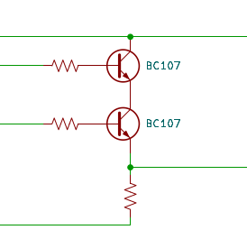
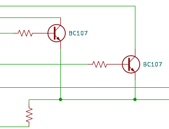
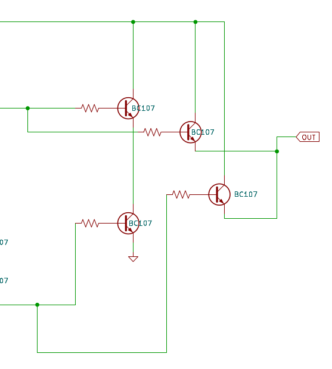
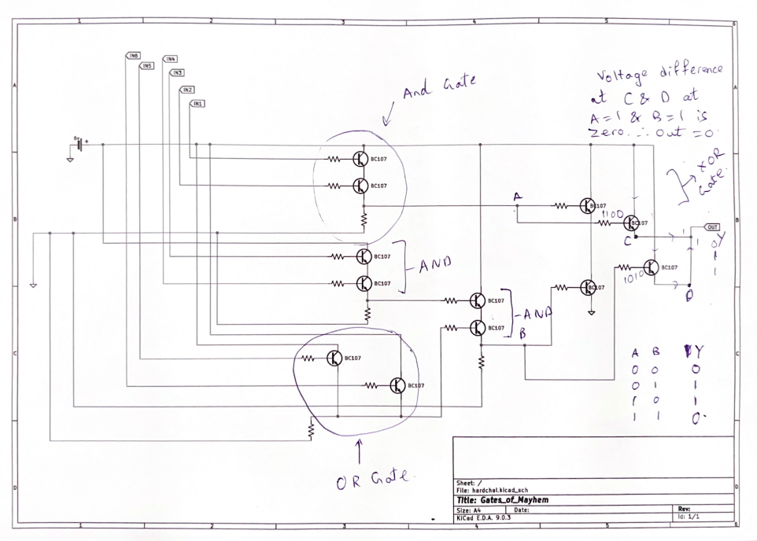

# Gates of Mayhem  

Description: 
iqtest but its on steriods and you have weird aah inputs aswell.

Was provided with `gates_of_mayhem.pdf` and `input_sequence.csv`

Provided schematic: 


Input Sequence: 

```
IN1,IN2,IN3,IN4,IN5,IN6
1,0,0,0,1,0
1,0,1,1,1,1
1,0,1,1,0,1
0,0,1,0,1,0
0,1,0,1,1,0
0,0,1,1,0,0
1,1,0,1,1,0
1,1,0,0,1,0
1,0,0,0,0,0
......
....
...
```

On looking at the schematic, I looked up what is `BC107`. 

`BC107` is a Binary Junction NPN Transistor.

Considering the input sequence is given in 0's and 1's, the given circuit has to form some sort of logical circuit. 

So my next thought was to look at Logic Gates made using BJTs. 
This is what I found: 

This combination represents an AND gate: 



This combination represents OR gate: 




So, up till now, tracing the given wires, we can deduce the following
- `in1` is in `AND` with `in2` -> lets take this as `a`
- `in3 and in4` -> lets take this as `x`
- `in4 or in6` -> lets take this as `y`
- `x and y` -> lets take this as `b`

I could not figure out this part of the circuit, so I mathematically traced the output.  





I traced this part of the circuit and figured out that its a XOR gate. 

The entire circuit can be boiled down to a single expression: 
`output = (in1 and in2) ^ ((in3 and in4) and (in5 or in6))`

I made a simple Python script to get the output for all the given inputs from the `input_sequence.csv` 

`script.py:`

```python
import csv

arr_output = []

with open('data.csv', newline='') as csvfile:
    reader = csv.reader(csvfile)
    
    for row in reader:
        in1 = int(row[0])
        in2 = int(row[1])
        in3 = int(row[2])
        in4 = int(row[3])
        in5 = int(row[4])
        in6 = int(row[5])
        #print(in1, in2, in3, in4, in5, in6) 
        output = (in1 and in2) ^ ((in3 and in4) and (in5 or in6))
        arr_output.append(str(output)) 
        
binary_string = ''.join(arr_output)

integer_value = int(binary_string, 2) # convert to integer from string

num_bytes = len(binary_string) // 8 #to get number of bytes 

byte_data = integer_value.to_bytes(num_bytes, byteorder="big")

print(byte_data)

decoded_text = byte_data.decode()

print(decoded_text)
```

Output: 
```
b'citadel{1_l0v3_t0_3xpl01t_l0g1c}'
citadel{1_l0v3_t0_3xpl01t_l0g1c}
```

flag: `citadel{1_l0v3_t0_3xpl01t_l0g1c}`