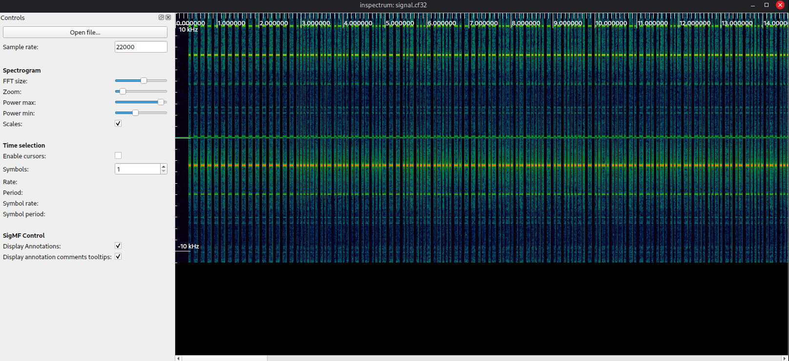
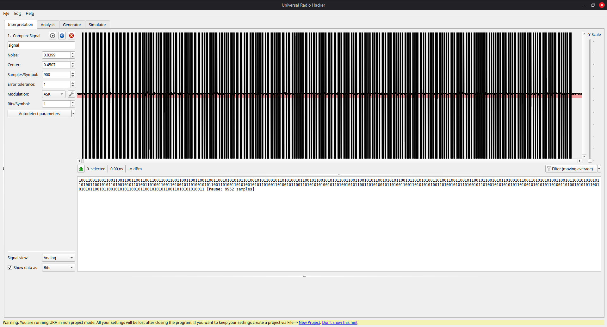
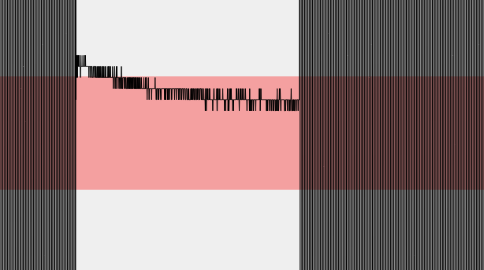
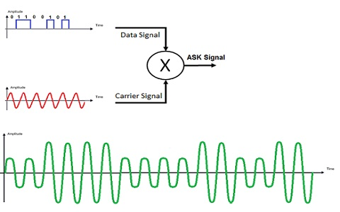
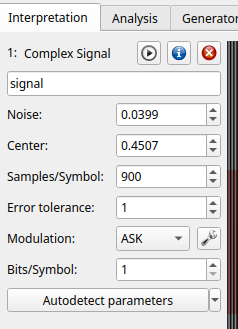
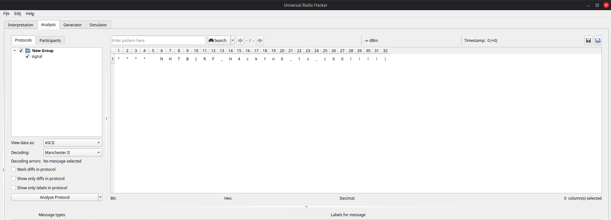
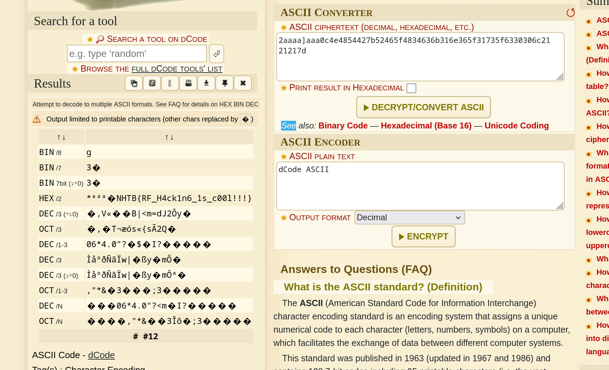

# Red Devil 

**Description:** 
this is the worst football team ever(i dont even watch football lmeow)

Was provided with a file `signal.cf32`

 A `.cf32` file is a raw data file used in Software-Defined Radio (SDR) and radar, containing Complex Float 32-bit data, essentially un-processed In-phase (I) and Quadrature (Q) samples, often stored in little-endian format (32-bit float for each I and Q sample)

  
 Let us analyse the waveform using `inspectrum` : 
 
 

Lets look at different types of digital radio modulations:

In digital modulation techniques, the carrier wave is digital and, in most RF modulation cases, is superimposed on an analog carrier: 

- **In Amplitude Shift Keying (ASK)**, different amplitude levels are assigned to different binary values. The carrier wave’s instantaneous amplitude is modified based on the digital signal’s value.
- **In Frequency Shift Keying (FSK)**, the carrier frequency is switched between two predetermined frequencies, one representing a binary 0 and the other representing a binary 1. 
- **In Phase Shift Keying (PSK)**, the phase of the carrier wave is adjusted at specific intervals based on the digital signal being transmitted
- **[Quadrature Amplitude Modulation (QAM)](https://resources.system-analysis.cadence.com/blog/msa2021-enhance-data-rates-and-bandwidth-with-quadrature-amplitude-modulation)** is a method that involves two message signals. The amplitudes of two carrier waves are modulated (often using ASK). These two carrier waves are out of phase with each other by 90 degrees. The waves are then added together to create a single signal. Once broadcasted and received, these two signals are demodulated and then separated. QAM’s higher data rate capabilities and robustness to [noise and interference](https://resources.pcb.cadence.com/blog/2022-rf-interference-types-and-effects) make it a preferred choice for various digital communication systems.


To analyse the given file and obtain its contents, I used the program called `urh`, which stands for `Universal Radio Hacker`. I found this program after reading writeups of similar radio hacking challenges.  



On zooming in the waveform, we can see the amplitude shifting, resembling ASK Modulation.  





I selected ASK modulation and clicked `Autodetect Parameters` to automatically detect the sample size.  



Now this data needs to be decoded using specific encoding schemes. 

Some types of encoding schemes are: 

```
NRZ -> non return to zero
NRZ + invert 
Manchester I
Manchester II 
Differential Manchester
```

I found out which type of encoding it was by trial and error. I could not find deduce which type of encoding it could be using the waveform or the sample size. 

I switched to the analysis tab and tried decoding using the schemes mentioned above. 

`Manchester II` gave me the flag. 



**Alternate solve (not counted as a valid solve)**

There is a tool called `rtl_433` which directly demodulates and decodes the given radio signal. 

This is how it works: 

```
> rtl_433 signal.cf32 -A
rtl_433 version 23.11 (2023-11-28) inputs file rtl_tcp RTL-SDR SoapySDR
[Input] Test mode active. Reading samples from file: signal.cf32
Detected OOK package	@0.220228s
Analyzing pulses...
Total count:  185,  width: 1837.12 ms		(459281 S)
Pulse width distribution:
 [ 0] count:  114,  width: 3608 us [3604;3624]	( 902 S)
 [ 1] count:   71,  width: 7204 us [7200;7208]	(1801 S)
Gap width distribution:
 [ 0] count:   71,  width: 7172 us [7172;7180]	(1793 S)
 [ 1] count:  113,  width: 3576 us [3576;3584]	( 894 S)
Pulse period distribution:
 [ 0] count:   57,  width: 10784 us [10780;10796]	(2696 S)
 [ 1] count:   42,  width: 14380 us [14376;14384]	(3595 S)
 [ 2] count:   85,  width: 7188 us [7184;7196]	(1797 S)
Pulse timing distribution:
 [ 0] count:  227,  width: 3592 us [3576;3624]	( 898 S)
 [ 1] count:  142,  width: 7188 us [7172;7208]	(1797 S)
 [ 2] count:    1,  width: 72084 us [72084;72084]	(18021 S)
Level estimates [high, low]:  15985,    488
RSSI: -0.2 dB SNR: 30.3 dB Noise: -30.5 dB
Frequency offsets [F1, F2]:   -5928,      0	(-22.6 kHz, +0.0 kHz)
Guessing modulation: Manchester coding
view at https://triq.org/pdv/#AAB1030E081C14FFFF819191919191919191919191919191918080808090818080918090808180918091808080919191808091808080918090808081908191918091809180809081809190808080819180918080808090819180809081808090819081919081809081808091908190808180809081908180919080808081809081808091908081809081919080808081908180809081809081808080808090818080808090819081808080918080809180918080809180918080809190808080819255
Attempting demodulation... short_width: 3608, long_width: 0, reset_limit: 7184, sync_width: 0
Use a flex decoder with -X 'n=name,m=OOK_MC_ZEROBIT,s=3608,l=0,r=7184'
[pulse_slicer_manchester_zerobit] Analyzer Device
codes     : {256}2aaaaaaa0c4e4854427b52465f4834636b316e365f31735f6330306c2121217d
```

The given hex provided by the program can be converted to ASCII to view the flag. 



**flag:** `HTB{RF_H4ck1n6_1s_c00l!!!}`


References: 
-  [https://resources.pcb.cadence.com/blog/2023-rf-modulation-types](https://resources.pcb.cadence.com/blog/2023-rf-modulation-types)


