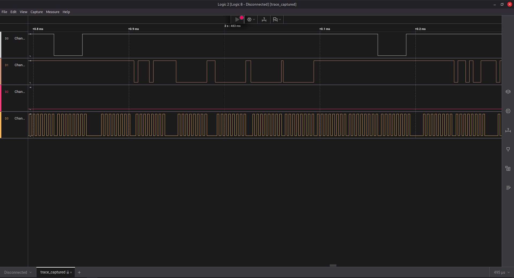
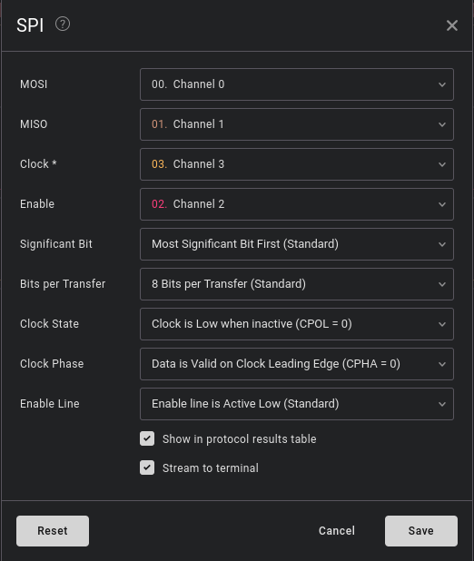

# i-like-logic more 

**Description:** 
idk man, i feel like microsd cards are a thing of the past.

Provided with a `.sal` file.  

My first thought was to check what protocol does the SD card run on.  
On looking it up, I got to know, that it runs on SPI protocol. 

SPI -> Serial Peripheral Interface 

I opened the file using Saleae logic software to look at its structure. 

SPI signal has 4 channels: 
- MOSI -> Master Out Slave In
- MISO -> Master In Slave Out
- Enable -> (slave select or chip select line)
- Clock 

Out objective is to figure out, which channel corresponds to the given signals. 

This is how the signal looks like: 

Our next objective is to find which one is MOSI channel, MISO channel etc. 
I looked up the structure of SPI signal and found that: 
- Channel 3 -> Clock
- Channel 2 -> Enable
- Channel 0 -> MOSI
- Channel 1 -> MISO 
  
Adding a SPI analyser and putting in appropriate values, I got the flag. 

**flag:** `HTB{unp2073c73d_532141_p2070c015_0n_53cu23_d3v1c35}`