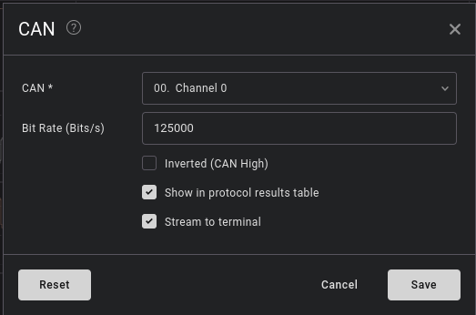
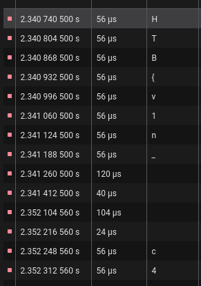

Description: 
i recently got involved in a hit and run case in pune, that kids porsche was going wayy too fast, if only i knew what the VIN of the car was :(

I looked up what is `VIN`, it turns out, its full form is `Vehical Identification Number`. 
In order to find the VIN of a car, we need to analyse its CAN signal. 
CAN -> Controller Area Network. 

What is CAN bus? 
CAN bus (Controller Area Network) is a communication system used in vehicles/machines to enable ECUs (Electronic Control Units) to communicate with each other - without a host computer. For example, the CAN bus enables quick and reliable sharing of information between your car's brakes and engine.

Lets looks at the structure of a CAN signal. 

A CAN bus signal looks like a differential pair of signals on two twisted wires (CAN_H and CAN_L), which are interpreted as two distinct states: dominant and recessive. In the dominant state (binary 0), the voltage difference between the two wires is distinct, with CAN_H at a higher voltage (around 3.5 V) and CAN_L at a lower one (around 1.5 V). In the recessive state (binary 1), both wires are at the same idle voltage (around 2.5 V). 

This is the provided signal:  


The first digital channel is what we are interested in. That's the one which needs to be decoded to get the flag.  

Just like any digital signal protocol like UART, we need to find the time for LSB(least significant bit) and then get the inverse of it, to get the baud rate.  

```
LSB time(t) = 8.34 us

Baud rate = (1/t)
 
Calculated baud rate: 119904.076738609 bits/second  
```

Lets add a CAN analyser and decode the data: 



This is what I got after adding a CAN decoder at the appropriate baud rate

Standard baud rates for CAN bus: 
- 125 kbps 
- 250 kbps 
- 500 kbps 
- 1 Mbps 

The nearest standard rate is 125 kbps
I tried 125 kbps got the flag. 




**Note:** You'll get output based on the efficiency of the ADC inside the logic analyser , that is why the calculated baud rate doesn't match the standard ones. 

**flag:** `HTB{v1n_c42_h4ck1n9_15_1337!*0^}`

Reference: 
- https://www.csselectronics.com/pages/can-bus-simple-intro-tutorial
