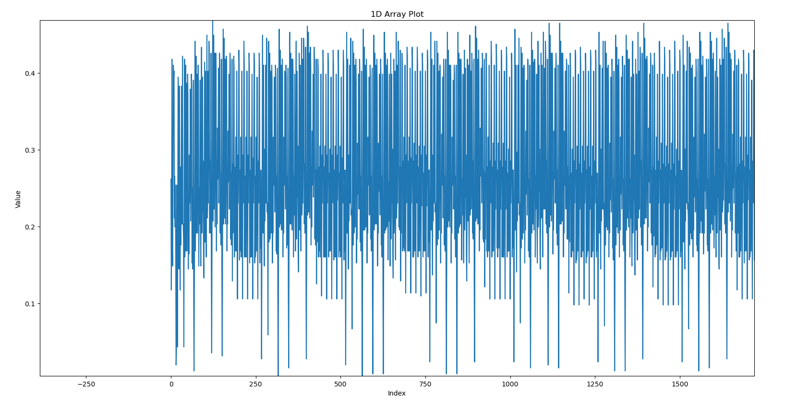

# Middle Fingers 

**Description:**
A damaged telemetry node was found repeatedly preparing an outbound 28 character long ASCII message, but with its RF stage dead the only observable output is the power trace of its baseband logic as it converts ASCII bytes into a bitstream and formats it for a 4-QPSK-style transmission mode. Combined with the knowledge that the transmitted message begins with nite, deduce how the device maps its processed symbols onto the waveform and recover the underlying ASCII. (Try to solve this challenge with automation via basic signal processing, as it sets a foundation to solve other hardware challenges, which is helpful for beginners)


Was provided with a file called `middle_fingers_trace.npy`. 

This file contains the power trace of the baseband logic. 
The baseband logic converts ASCII bytes into a bitstream and formats it for a 4-QPSK style transmission mode. 

**Bitstream:** Convert the message into 0's and 1's 
**4-QPSK style transmission mode:** Quadrature Phase Shift Keying (QPSK) is a widely used digital modulation technique in communications. 

Now my next step would be to visualise the `.npy` file using `matplotlib` . 

```python
import numpy as np
import matplotlib.pyplot as plt

data = np.load('middle_fingers_trace.npy')

print(f"Data shape: {data.shape}")
print(f"Data type: {data.dtype}")

plt.plot(data)
plt.xlabel('Index')
plt.ylabel('Value')
plt.title('1D Array Plot')
plt.show()
```

Output: 
```
Data shape: (28000,)
Data type: float64
[0.26171875 0.1171875  0.21484375 ... 0.36328125 0.10546875 0.23828125]
```



The above image shows waveform of the power trace. We can see a periodic pattern in the waveform. 
# How QPSK Works

QPSK modulates a carrier signal by changing its phase to one of four distinct states. This allows each phase state (symbol) to represent two bits of digital data, as there are four possible 2-bit combinations (00, 01, 10, 11). 

- **Bits per Symbol:** 2 bits.
- **Number of Phases:** 4 distinct phases (e.g., 45°, 135°, 225°, and 315°, or 0°, 90°, 180°, and 270°).
- **Bandwidth Efficiency:** QPSK is twice as bandwidth-efficient as Binary Phase Shift Keying (BPSK) because it transmits twice the data rate within the same bandwidth.


Our main goal here is to decode the modulation, which I couldn't do due to my lack of skill. 