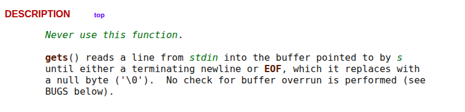
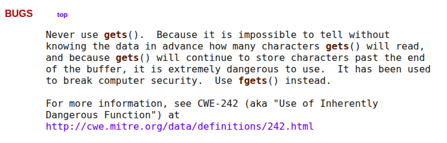
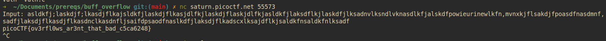

# Buffer Overflow 0  

Description
Let's start off simple, can you overflow the correct buffer? The program is available here. You can view source here.

Connect using:
`nc saturn.picoctf.net 55573`

I was given two files, namely `vuln` and `vuln.c`. 
`vuln` is a binary executable file, whereas `vuln.c` is a basic c file. 

Contents of `vuln.c`:
```C
#include <signal.h>

#define FLAGSIZE_MAX 64

char flag[FLAGSIZE_MAX];

void sigsegv_handler(int sig) {
  printf("%s\n", flag);
  fflush(stdout);
  exit(1);
}

void vuln(char *input){
  char buf2[16];
  strcpy(buf2, input);
}

int main(int argc, char **argv){

  FILE *f = fopen("flag.txt","r");
  if (f == NULL) {
    printf("%s %s", "Please create 'flag.txt' in this directory with your",
                    "own debugging flag.\n");
    exit(0);
  }

  fgets(flag,FLAGSIZE_MAX,f);
  signal(SIGSEGV, sigsegv_handler); // Set up signal handler

  gid_t gid = getegid();
  setresgid(gid, gid, gid);


  printf("Input: ");
  fflush(stdout);
  char buf1[100];
  gets(buf1);
  vuln(buf1);
  printf("The program will exit now\n");
  return 0;
}
```


On running `nc saturn.picoctf.net 55573` ,  the program showed me `Input: ` and I gave random input and the program exited. 


On further inspection in `vuln.c`, I could see `char buf1[100]`. Which meant `buf1` or buffer 1 was allocated a size of 100 chars. 

In the given function, we can see that `buf2` is assigned 16 chars and the user input is being copied into buf2. This means, any input greater than 16 chars will overflow the buffer and give out the flag.

```c
void vuln(char *input){
  char buf2[16];
  strcpy(buf2, input);
}
```

The first hint of the problem told me to look at the man page for the `gets` function.
So I did just that. 

On reading its description I found this: 


On looking at the BUGS section: 



What this meant is that the `gets` function does not check for buffer overflow and gives output even if the given limit is exceeded. This is a critical security issue and is used for exploitation. 

On passing input of more than 16 chars, the program gave out the flag. 



Flag: `picoCTF{ov3rfl0ws_ar3nt_that_bad_c5ca6248}`

---
# Format String 0 

Can you use your knowledge of format strings to make the customers happy?Download the binary [here](https://artifacts.picoctf.net/c_mimas/77/format-string-0).Download the source [here](https://artifacts.picoctf.net/c_mimas/77/format-string-0.c).

Contents of `format-string-0.c` :
```c
#include <stdio.h>
#include <stdlib.h>
#include <string.h>
#include <signal.h>
#include <unistd.h>
#include <sys/types.h>

#define BUFSIZE 32
#define FLAGSIZE 64

char flag[FLAGSIZE];

void sigsegv_handler(int sig) {
    printf("\n%s\n", flag);
    fflush(stdout);
    exit(1);
}

int on_menu(char *burger, char *menu[], int count) {
    for (int i = 0; i < count; i++) {
        if (strcmp(burger, menu[i]) == 0)
            return 1;
    }
    return 0;
}

void serve_patrick();

void serve_bob();


int main(int argc, char **argv){
    FILE *f = fopen("flag.txt", "r");
    if (f == NULL) {
        printf("%s %s", "Please create 'flag.txt' in this directory with your",
                        "own debugging flag.\n");
        exit(0);
    }

    fgets(flag, FLAGSIZE, f);
    signal(SIGSEGV, sigsegv_handler);

    gid_t gid = getegid();
    setresgid(gid, gid, gid);

    serve_patrick();
  
    return 0;
}

void serve_patrick() {
    printf("%s %s\n%s\n%s %s\n%s",
            "Welcome to our newly-opened burger place Pico 'n Patty!",
            "Can you help the picky customers find their favorite burger?",
            "Here comes the first customer Patrick who wants a giant bite.",
            "Please choose from the following burgers:",
            "Breakf@st_Burger, Gr%114d_Cheese, Bac0n_D3luxe",
            "Enter your recommendation: ");
    fflush(stdout);

    char choice1[BUFSIZE];
    scanf("%s", choice1);
    char *menu1[3] = {"Breakf@st_Burger", "Gr%114d_Cheese", "Bac0n_D3luxe"};
    if (!on_menu(choice1, menu1, 3)) {
        printf("%s", "There is no such burger yet!\n");
        fflush(stdout);
    } else {
        int count = printf(choice1);
        if (count > 2 * BUFSIZE) {
            serve_bob();
        } else {
            printf("%s\n%s\n",
                    "Patrick is still hungry!",
                    "Try to serve him something of larger size!");
            fflush(stdout);
        }
    }
}

void serve_bob() {
    printf("\n%s %s\n%s %s\n%s %s\n%s",
            "Good job! Patrick is happy!",
            "Now can you serve the second customer?",
            "Sponge Bob wants something outrageous that would break the shop",
            "(better be served quick before the shop owner kicks you out!)",
            "Please choose from the following burgers:",
            "Pe%to_Portobello, $outhwest_Burger, Cla%sic_Che%s%steak",
            "Enter your recommendation: ");
    fflush(stdout);

    char choice2[BUFSIZE];
    scanf("%s", choice2);
    char *menu2[3] = {"Pe%to_Portobello", "$outhwest_Burger", "Cla%sic_Che%s%steak"};
    if (!on_menu(choice2, menu2, 3)) {
        printf("%s", "There is no such burger yet!\n");
        fflush(stdout);
    } else {
        printf(choice2);
        fflush(stdout);
    }
}
```

`%114d`

Referred to this article to understand what a format string vulnerability is:  
https://owasp.org/www-community/attacks/Format_string_attack

To understand the attack, it’s necessary to understand the components that constitute it.
•The **Format Function** is an ANSI C conversion function, like **printf, fprintf**, which converts a primitive variable of the programming language into a human-readable string representation.
•The **Format String** is the argument of the Format Function and is an ASCII Z string which contains text and format parameters, like: **printf (“The magic number is: %d\n”, 1911)**;
•The **Format String Parameter**, like **%x %s** defines the type of conversion of the format function.

To understand format string vulnerability an example was given in the website: 

## Example

```
#include  <stdio.h> 
void main(int argc, char **argv)
{
	// This line is safe
	printf("%s\n", argv[1]);

	// This line is vulnerable
	printf(argv[1]);
}
```

### Safe Code

The line `printf("%s", argv[1]);` in the example is safe, if you compile the program and run it:

`./example "Hello World %s%s%s%s%s%s"`

The `printf` in the first line will not interpret the “%s%s%s%s%s%s” in the input string, and the output will be: “Hello World %s%s%s%s%s%s”

### Vulnerable Code

The line `printf(argv[1]);` in the example is vulnerable, if you compile the program and run it:

`./example "Hello World %s%s%s%s%s%s"`

The `printf` in the second line will interpret the `%s%s%s%s%s%s` in the input string as a reference to string pointers, so it will try to interpret every %s as a pointer to a string, starting from the location of the buffer (probably on the Stack). At some point, it will get to an invalid address, and attempting to access it will cause the program to crash.

We can also use different payloads like `%p`, `%s`, `%x` etc.  

In the given program, we can see the choices are printed without the proper format specified making them vulnerable to format string vulnerabilities. 

Passing the only strings which contain format specifiers as an input gave me the flag.   

```
➜  ~ nc mimas.picoctf.net 61644

Welcome to our newly-opened burger place Pico 'n Patty! Can you help the picky customers find their favorite burger?
Here comes the first customer Patrick who wants a giant bite.
Please choose from the following burgers: Breakf@st_Burger, Gr%114d_Cheese, Bac0n_D3luxe
Enter your recommendation: Gr%114d_Cheese
Gr                                                                                                           4202954_Cheese
Good job! Patrick is happy! Now can you serve the second customer?
Sponge Bob wants something outrageous that would break the shop (better be served quick before the shop owner kicks you out!)
Please choose from the following burgers: Pe%to_Portobello, $outhwest_Burger, Cla%sic_Che%s%steak
Enter your recommendation: Cla%sic_Che%s%steak
ClaCla%sic_Che%s%steakic_Che(null)
picoCTF{7h3_cu570m3r_15_n3v3r_SEGFAULT_f89c1405}
```

flag: `picoCTF{7h3_cu570m3r_15_n3v3r_SEGFAULT_f89c1405}`

---
# Clutter Overflow 

```
break *main
run
disassemble main
set disassembly-flavor intel 
info proc mappings -> shows the stack 
x/wx $esp -> shows the position of the stack pointer  
```


leave -> set esp to ebp, then pop ebp  
```
leave: mov esp, ebp
       pop ebp  
```

`lea eax, [esp+0x1c]` does eax=esp+0x1c

```
# This will print the registers, the stack and the next two instructions 
define hook-step
info registers 
x/24wx $rsp
x/21 $rip 
end
```

flag: `picoCTF{c0ntr0ll3d_clutt3r_1n_my_buff3r}` 


