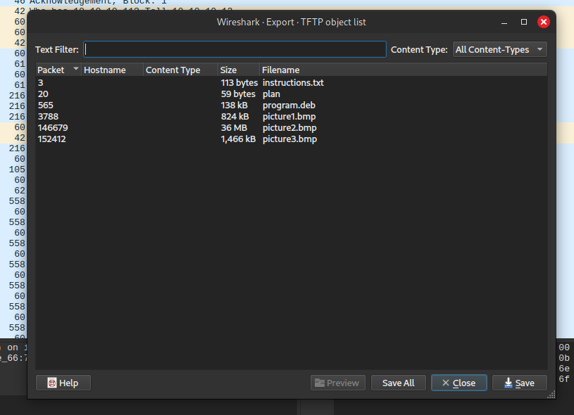

# Trivial Flag Transfer Protocol

Figure out how they moved the flag.

The given link, was to a file named `tftp.pcapng`.

I had to lookup what a `.pcapng` file was and from what I could understand, it had to do something with packets and file transfer. This file can be opened with an application called Wireshark. `.pcapng` file is a packet capture file where packets are sniffed from a given network. 

I exported all the files from `tftp.pcapng` and got the following: 

1) `program.deb` -> This file was the installer for a Steganography tool called **Steghide**

2) `instructions.txt` -> Contained gibberish and had to run it through Cipher Identifier from https://dcode.fr. The tool detected that it was encoded using ROT13 Cipher. This is what it said after decoding: 
   `TFTPDOESNTENCRYPTOURTRAFFICSOWEMUSTDISGUISEOURFLAGTRANSFER.FIGUREOUTAWAYTOHIDETHEFLAGANDIWILLCHECKBACKFORTHEPLAN`

3) `plan` -> This was a plain text file and contained gibberish. On running it through Cipher Identifier tool from https://dcode.fr, it found out that it was encoded using ROT13 Cipher.  On decoding this is what it said: 
   `IUSEDTHEPROGRAMANDHIDITWITH-DUEDILIGENCE.CHECKOUTTHEPHOTOS`

4) `picture1.bmp`, `picture2.bmp`, `picture3.bmp` -> I used **Steghide** to extract data from these images. 
   Command used: `steghide extract -sf picture*.bmp`
   it asked for the passphrase and using the `plan` file I assumed it would be `DUEDILIGENCE`. On inputting the passphrase in `picture3.bmp`, it gave me a file called `flag.txt`, which contained the answer for the challenge. (**Note**: `picture1.bmp` and `picture2.bmp` resulted in error when using the above passphrase, only the third one worked which was the answer)

The required flag: `picoCTF{h1dd3n_1n_pLa1n_51GHT_18375919}`
