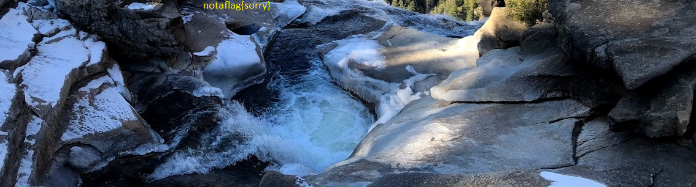

# Trivial Flag Transfer Protocol

Figure out how they moved the flag.

The given link, was to a file named `tftp.pcapng`.

I had to lookup what a `.pcapng` file was and from what I could understand, it had to do something with packets and file transfer. This file can be opened with an application called Wireshark. `.pcapng` file is a packet capture file where packets are sniffed from a given network. 

I exported all the files from `tftp.pcapng` and got the following(File->Export Objects->TFTP): 


1) `program.deb` -> This file was the installer for a Steganography tool called **Steghide**

2) `instructions.txt` -> Contained gibberish and had to run it through Cipher Identifier from https://dcode.fr. The tool detected that it was encoded using ROT13 Cipher. This is what it said after decoding: 
   `TFTPDOESNTENCRYPTOURTRAFFICSOWEMUSTDISGUISEOURFLAGTRANSFER.FIGUREOUTAWAYTOHIDETHEFLAGANDIWILLCHECKBACKFORTHEPLAN`

3) `plan` -> This was a plain text file and contained gibberish. On running it through Cipher Identifier tool from https://dcode.fr, it found out that it was encoded using ROT13 Cipher.  On decoding this is what it said: 
   `IUSEDTHEPROGRAMANDHIDITWITH-DUEDILIGENCE.CHECKOUTTHEPHOTOS`

4) `picture1.bmp`, `picture2.bmp`, `picture3.bmp` -> I used **Steghide** to extract data from these images. 
   Command used: `steghide extract -sf picture*.bmp`
   it asked for the passphrase and using the `plan` file I assumed it would be `DUEDILIGENCE`. On inputting the passphrase in `picture3.bmp`, it gave me a file called `flag.txt`, which contained the answer for the challenge. (**Note**: `picture1.bmp` and `picture2.bmp` resulted in error when using the above passphrase, only the third one worked which was the answer)


The required flag: `picoCTF{h1dd3n_1n_pLa1n_51GHT_18375919}`

---

# tunn3l v1s10n 

Description: 
We found this [file](https://mercury.picoctf.net/static/d0129ad98ba9258ab59e7700a1b18c14/tunn3l_v1s10n). Recover the flag.

Provided with a file called `tunn3l_v1s10n` . 
I started off with basic analysis. This is what I did first: 
```bash
> file tunn3l_v1s10n
tunn3l_v1s10n: data 
> strings tunn3l_v1s10n
# lots of gibberish, nothing interesting, even after grepping 
```

I could find anything interesting with the `file` and the `strings` command. Now my next through was to check the hexdump of the header of the file, to look for the magic bytes. 

Magic bytes are the first few bytes in the header of a file, which actually define what type of file it is and its structure is. 

I used `xxd` to get the hexdump of the header.  

```bash
> xxd -l 64 tunn3l_v1s10n
00000000: 424d 8e26 2c00 0000 0000 bad0 0000 bad0  BM.&,...........
00000010: 0000 6e04 0000 3201 0000 0100 1800 0000  ..n...2.........
00000020: 0000 5826 2c00 2516 0000 2516 0000 0000  ..X&,.%...%.....
00000030: 0000 0000 0000 231a 1727 1e1b 2920 1d2a  ......#..'..) .*
```

The `bad0` bytes seem suspicious. My next idea was to check which file type's initial bytes are `424d 8e26 2c00 0000`. 

Using this list: https://gist.github.com/leommoore/f9e57ba2aa4bf197ebc5, I found out that the file given to me was a Windows Bitmap Image file with a few corrupted bytes(`bad0`). 

By referring to this wikipedia page, I found out how the header for the Bitmap Image file looks like. 
https://en.wikipedia.org/wiki/BMP_file_format

This is how the windows bitmap header looks like: 
- `42 4D` → "BM" -> signature for a Windows Bitmap file (.bmp)
- `8E 26 2C 00` → file size in bytes 
- `00 00` + `00 00` → reserved fields
- `36 00 00 00` → pixel array starts at offset 54 bytes, in my case it was `bad0`
- `28 00 00 00` → DIB header size = 40 bytes, `bad0` in my case

I have to replace the `bad0` bytes with the appropriate format. 

I used `hexedit` to replace the first `bad0` with `36 00` and the second one with `28 00`. 

After changing those values, I got a bitmap image which looked something like this: 


This is how the header looked like after the initial correction: 
``` bash 
> xxd -l 128 tunn3l_v1s10n_width_fixed
00000000: 424d 8e26 2c00 0000 0000 3600 0000 2800  BM.&,.....6...(.
00000010: 0000 6e04 0000 3201 0000 0100 1800 0000  ..n...2.........
00000020: 0000 5826 2c00 2516 0000 2516 0000 0000  ..X&,.%...%.....
00000030: 0000 0000 0000 231a 1727 1e1b 2920 1d2a  ......#..'..) .*
00000040: 211e 261d 1a31 2825 352c 2933 2a27 382f  !.&..1(%5,)3*'8/
00000050: 2c2f 2623 332a 262d 2420 3b32 2e32 2925  ,/&#3*&-$ ;2.2)%
00000060: 3027 2333 2a26 382c 2836 2b27 392d 2b2f  0'#3*&8,(6+'9-+/
00000070: 2623 1d12 0e23 1711 2916 0e55 3d31 9776  &#...#..)..U=1.v
```

The bytes after `36 00` and `28 00` are the ones which tell the width and the height of the image.  

 Width: `6e04 0000` -> 0x046E(lsb notation by default) = 1134 pixels
 Height:  `3201 0000` -> 0x0132 -> 306 pixels

  I changed the height of the image to match the width and make it a proper square. 

Changed `3201 0000` -> `6e04 0000` using `hexedit`. 

This is what I got finally: 


The flag is now clearly visible in the picture. 

I went on multiple tangents during this challenge, by changing the bytes of the rgb values, changing contrast etc. to get the flag. Changing the height gave me the flag. 

flag: `picoCTF{qu1t3_a_v13w_2020}`


---

# m00nwalk 

