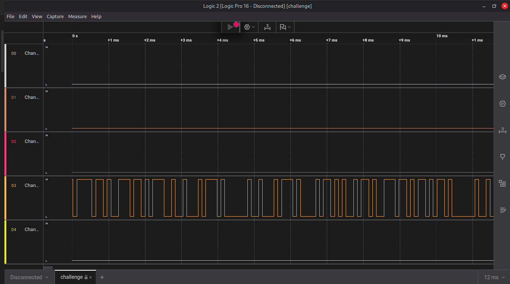
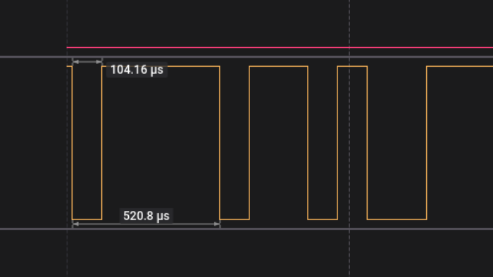
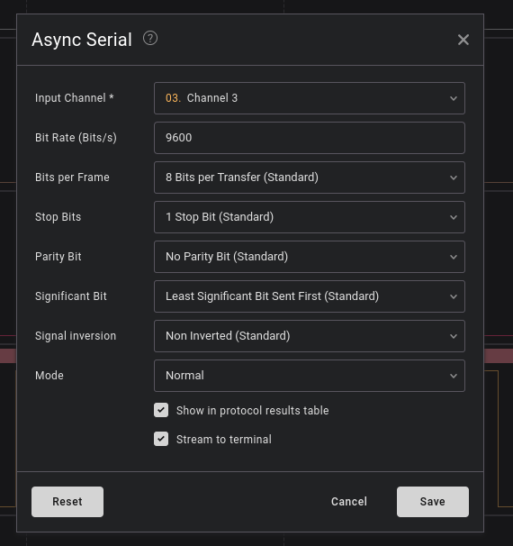

# IQ Test

---
# I Like Logic 

Description: 
i like logic and i like files, apparently, they have something in common, what should my next step be.
### Solve: 
The challenge provided me with a file called `challenge.sal` . On looking up what are `.sal` files, they are Saleae Logic Analyser capture files. It captures data from a logic analyser. 

I opened the file using the Saleae 2 Logic software, and it looked something like this: 


My first speculation was that, considering there's only one channel, it has to be a UART signal. 
To analyse a UART signal and decode meaningful data from it, we need to know the baud rate. 
Next step, finding the baud rate to decode the data. 

Baud rate is the number of symbols transmitted per second over a communication channel. 
Basically -> signals/second. 

To calculate baud rate of a signal, you need to find out the lowest time taken for the transmission of the Least Significant Bit in the signal, which is the lowest time for the 'off' signal. 


The lowest time I could find was 104.16 us 
Therefore, calculating baud rate: 

```
   1 
-------- X 1000000 = 9600.614439324 
 104.16
```

Comparing the result with standard baud rates. 
nearest baud rate was 9600 

Lets configure the analyser with this standard value.

Add Analyser -> Async Serial -> 



This is the data I got after decoding the signal. 

```
on't think he makes any claims of
that kind.  But I do believe he has got something new."

"Then for Heaven's sake, man, write it up!"

"I'm longing to, but all I know he gave me in confidence and on
condition that I didn't."  I condensed into a few sentences the
Professor's narrative.  "That's how it stands."

McArdle looked deeply incredulous.

"Well, Mr. Malone," he said at last, "about this scientific meeting
to-night; there can be no privacy about that, anyhow.  I don't suppose
any paper will want to report it, for Waldron has been reported already
a dozen times, and no one is aware that Challenger will speak.  We may
get a scoop, if we are lucky.  You'll be there in any case, so you'll
just give us a pretty full report.  I'll keep space up to midnight."

My day was a busy one, and I had an early dinner at the Savage Club
with Tarp Henry, to whom I gave some account of my adventures.  He
listened with a sceptical smile on his gaunt face, and roared with
laughter on hearing that the Professor had convinced me.

"My dear chap, things don't happen like that in real life.  People
don't stumble upon enormous discoveries and then lose their evidence.
Leave that to the novelists.  The fellow is as full of tricks as the
monkey-house at the Zoo.  It's all bosh."

"But the American poet?"

"He never existed."

"I saw his sketch-book."

"Challenger's sketch-book."

"You think he drew that animal?"

"Of course he did.  Who else?"

"Well, then, the photographs?"

"There was nothing in the photographs.  By your own admission you only
saw a bird."

FCSC{b1dee4eeadf6c4e60aeb142b0b486344e64b12b40d1046de95c89ba5e23a9925}

"A pterodactyl."

"That's what HE says.  He put the pterodactyl into your head."

"Well, then, the bones?"

"First one out of an Irish stew.  Second one vamped up for the
occasion.  If you are clever and know your business you can fake a bone
as easily as you can a photograph."

I began to feel uneasy.  Perhaps, after all, I had been premature in my
acquiescence.  Then I had a sudden happy thought.

"Will you come to the meeting?" I asked.

.......
......
....
...
..
.
```


The flag was right there in between the lines of the paragraph: 

flag: `FCSC{b1dee4eeadf6c4e60aeb142b0b486344e64b12b40d1046de95c89ba5e23a9925}`

#### Reference: 
https://kashmir54.github.io/ctfs/CyberApocalypse2021/

---

# Bare Metal Alchemist 


