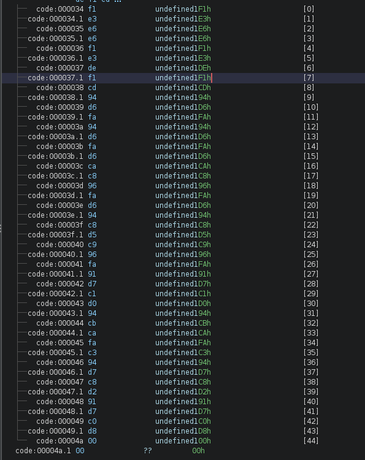

# IQ Test

Description: 
let your input x = 30478191278.

wrap your answer with nite{ } for the flag.

As an example, entering x = 34359738368 gives (y0, ..., y11), so the flag would be nite{010000000011}.

Given input: `30478191278`
Converting that to binary: `11100011000101001000100101010101110`
There are total 36 inputs and 12 outputs. 
But the binary number we got was 35 digits and not 36. 
Therefore, a 0 has to be prepended to the given binary number to make it fit into the 36 inputs. 
By using Boolean algebra, the following result was obtained: 

Input: `011100011000101001000100101010101110`

Output: `100010011000`


flag: `nite{100010011000}`

---
# I Like Logic 

Description: 
i like logic and i like files, apparently, they have something in common, what should my next step be.
### Solve: 
The challenge provided me with a file called `challenge.sal` . On looking up what are `.sal` files, they are Saleae Logic Analyser capture files. It captures data from a logic analyser. 

I opened the file using the Saleae 2 Logic software, and it looked something like this: 


My first speculation was that, considering there's only one channel, it has to be a UART signal. 
To analyse a UART signal and decode meaningful data from it, we need to know the baud rate. 
Next step, finding the baud rate to decode the data. 

Baud rate is the number of symbols transmitted per second over a communication channel. 
Basically -> signals/second. 

To calculate baud rate of a signal, you need to find out the lowest time taken for the transmission of the Least Significant Bit in the signal, which is the lowest time for the 'off' signal. 


The lowest time I could find was 104.16 us 
Therefore, calculating baud rate: 

```
   1 
-------- X 1000000 = 9600.614439324 
 104.16
```

Comparing the result with standard baud rates. 
nearest baud rate was 9600 

Lets configure the analyser with this standard value.

Add Analyser -> Async Serial -> 


This is the data I got after decoding the signal. 

```
on't think he makes any claims of
that kind.  But I do believe he has got something new."

"Then for Heaven's sake, man, write it up!"

"I'm longing to, but all I know he gave me in confidence and on
condition that I didn't."  I condensed into a few sentences the
Professor's narrative.  "That's how it stands."

McArdle looked deeply incredulous.

"Well, Mr. Malone," he said at last, "about this scientific meeting
to-night; there can be no privacy about that, anyhow.  I don't suppose
any paper will want to report it, for Waldron has been reported already
a dozen times, and no one is aware that Challenger will speak.  We may
get a scoop, if we are lucky.  You'll be there in any case, so you'll
just give us a pretty full report.  I'll keep space up to midnight."

My day was a busy one, and I had an early dinner at the Savage Club
with Tarp Henry, to whom I gave some account of my adventures.  He
listened with a sceptical smile on his gaunt face, and roared with
laughter on hearing that the Professor had convinced me.

"My dear chap, things don't happen like that in real life.  People
don't stumble upon enormous discoveries and then lose their evidence.
Leave that to the novelists.  The fellow is as full of tricks as the
monkey-house at the Zoo.  It's all bosh."

"But the American poet?"

"He never existed."

"I saw his sketch-book."

"Challenger's sketch-book."

"You think he drew that animal?"

"Of course he did.  Who else?"

"Well, then, the photographs?"

"There was nothing in the photographs.  By your own admission you only
saw a bird."

FCSC{b1dee4eeadf6c4e60aeb142b0b486344e64b12b40d1046de95c89ba5e23a9925}

"A pterodactyl."

"That's what HE says.  He put the pterodactyl into your head."

"Well, then, the bones?"

"First one out of an Irish stew.  Second one vamped up for the
occasion.  If you are clever and know your business you can fake a bone
as easily as you can a photograph."

I began to feel uneasy.  Perhaps, after all, I had been premature in my
acquiescence.  Then I had a sudden happy thought.

"Will you come to the meeting?" I asked.

.......
......
....
...
..
.
```


The flag was right there in between the lines of the paragraph: 

flag: `FCSC{b1dee4eeadf6c4e60aeb142b0b486344e64b12b40d1046de95c89ba5e23a9925}`

#### Reference: 
https://kashmir54.github.io/ctfs/CyberApocalypse2021/

---

# Bare Metal Alchemist 

Description: 
my friend recommended me this anime but i think i've heard a wrong name.

Provided with a file `firmware.elf`

Primary Analysis: 

```
> file firmware.elf 
firmware.elf: ELF 32-bit LSB executable, Atmel AVR 8-bit, version 1 (SYSV), statically linked, with debug_info, not stripped
```

```
> strings firmware.elf 
[Ofm}
w|9^yq=t
w|9^yq=t
GCC: (GNU) 7.3.0
atmega328p
../../../../gcc/libgcc/config/avr/lib1funcs.S
/home/jenkins/workspace/avr-gcc-staging/label/debian7-x86_64/gcc-build/avr/avr5/libgcc
GNU AS 2.26
../../../../gcc/libgcc/config/avr/lib1funcs.S
/home/jenkins/workspace/avr-gcc-staging/label/debian7-x86_64/gcc-build/avr/avr5/libgcc
GNU AS 2.26
../../../../gcc/libgcc/config/avr/lib1funcs.S
/home/jenkins/workspace/avr-gcc-staging/label/debian7-x86_64/gcc-build/avr/avr5/libgcc
GNU AS 2.26
../../../../gcc/libgcc/config/avr
lib1funcs.S
../../../../gcc/libgcc/config/avr
lib1funcs.S
../../../../gcc/libgcc/config/avr
lib1funcs.S
avr-libc 2.0.0
uint8_t
uint16_t
__eeprom
UDR0
UCSR0A
UCSR0B
UCSR0C
UBRR0
TWAMR
TWBR
TWCR
TWSR
TWDR
TWAR
TIMSK1
TIFR1
TCCR1A
TCCR1B
TCCR1C
TCNT1
OCR1A
OCR1B
ICR1
GTCCR
TIMSK2
TIFR2
TCCR2A
TCCR2B
TCNT2
OCR2B
OCR2A
ASSR
GTCCR
ADMUX
ADCSRA
ADCSRB
DIDR0
ACSR
DIDR1
PORTB
DDRB
PINB
PORTC
DDRC
PINC
PORTD
DDRD
PIND
OCR0B
OCR0A
TCNT0
TCCR0B
TCCR0A
TIMSK0
TIFR0
GTCCR
EICRA
EIMSK
EIFR
PCICR
PCMSK2
PCMSK1
PCMSK0
PCIFR
SPDR
SPSR
SPCR
WDTCSR
OSCCAL
CLKPR
SREG
SPMCSR
MCUCR
MCUSR
SMCR
GPIOR2
GPIOR1
GPIOR0
EEAR
EEDR
EECR
__SP_H__
__SP_L__
__SREG__
__tmp_reg__
__zero_reg__
_ZL2z1v
timer0_millis
timer0_fract
timer0_overflow_count
_ZL2Xf
CSWTCH.14
_clear_bss.o
.do_clear_bss_start
.do_clear_bss_loop
_exit.o
__stop_program
__vector_22
__vector_1
__DATA_REGION_LENGTH__
__trampolines_start
_etext
__vector_24
__vector_12
__bad_interrupt
__data_load_end
__vector_6
__trampolines_end
__vector_3
__vector_23
__data_load_start
__dtors_end
__bss_end
__LOCK_REGION_LENGTH__
__vector_25
__vector_11
__init
_Z14serialEventRunv
__vector_13
__vector_17
__vector_19
__vector_7
__do_clear_bss
__eeprom_end
__vectors
__data_end
__vector_default
__vector_5
__SIGNATURE_REGION_LENGTH__
__ctors_start
__do_copy_data
__bss_start
main
__vector_4
__heap_end
__vector_9
__vector_2
__USER_SIGNATURE_REGION_LENGTH__
__vector_21
__vector_15
__dtors_start
__ctors_end
__stack
_edata
__vector_8
__EEPROM_REGION_LENGTH__
_exit
__vector_14
__vector_10
__vector_16
__data_start
__vector_18
__FUSE_REGION_LENGTH__
__TEXT_REGION_LENGTH__
__vector_20
.symtab
.strtab
.shstrtab
.data
.text
.bss
.comment
.note.gnu.avr.deviceinfo
.debug_aranges
.debug_info
.debug_abbrev
.debug_line
.debug_str
```

After this, I disassembled the elf file using `avr-gdb` as the file was an AVR elf file. But that didn't yield any good results as I cannot read assembly. As per the hint given by the mentor, I decompiled the file using Ghidra to view the code in C, which is much more readable than Assembly.  

We can see the decompiled code on the right in C .


This is the main function, lets analyse, what this function does. 
```c

void main(void)

{
  char cVar1;
  byte bVar2;
  char cVar3;
  undefined1 auStack_7 [3];
  undefined3 uStack_4;
  undefined1 uStack_1;
  
  R1 = 0;
  uStack_1 = Y._1_1_;
  uStack_4 = 0xbe;
  Y = CONCAT11((char)((uint)(auStack_7 + 2) >> 8),(char)auStack_7 + '\x02');
  R25R24._0_1_ = DAT_mem_0044;
  R25R24._0_1_ = (byte)R25R24 | 2;
  DAT_mem_0044 = (byte)R25R24;
  R25R24._0_1_ = DAT_mem_0044;
  R25R24._0_1_ = (byte)R25R24 | 1;
  DAT_mem_0044 = (byte)R25R24;
  R25R24._0_1_ = DAT_mem_0045;
  R25R24._0_1_ = (byte)R25R24 | 2;
  DAT_mem_0045 = (byte)R25R24;
  R25R24._0_1_ = DAT_mem_0045;
  R25R24._0_1_ = (byte)R25R24 | 1;
  DAT_mem_0045 = (byte)R25R24;
  R25R24._0_1_ = DAT_mem_006e;
  R25R24._0_1_ = (byte)R25R24 | 1;
  DAT_mem_006e = (byte)R25R24;
  DAT_mem_0081 = 0;
  R25R24._0_1_ = DAT_mem_0081;
  R25R24._0_1_ = (byte)R25R24 | 2;
  DAT_mem_0081 = (byte)R25R24;
  R25R24._0_1_ = DAT_mem_0081;
  R25R24._0_1_ = (byte)R25R24 | 1;
  DAT_mem_0081 = (byte)R25R24;
  R25R24._0_1_ = DAT_mem_0080;
  R25R24._0_1_ = (byte)R25R24 | 1;
  DAT_mem_0080 = (byte)R25R24;
  R25R24._0_1_ = DAT_mem_00b1;
  R25R24._0_1_ = (byte)R25R24 | 4;
  DAT_mem_00b1 = (byte)R25R24;
  R25R24._0_1_ = DAT_mem_00b0;
  R25R24._0_1_ = (byte)R25R24 | 1;
  DAT_mem_00b0 = (byte)R25R24;
  R25R24._0_1_ = DAT_mem_007a;
  R25R24._0_1_ = (byte)R25R24 | 4;
  DAT_mem_007a = (byte)R25R24;
  R25R24._0_1_ = DAT_mem_007a;
  R25R24._0_1_ = (byte)R25R24 | 2;
  DAT_mem_007a = (byte)R25R24;
  R25R24._0_1_ = DAT_mem_007a;
  R25R24._0_1_ = (byte)R25R24 | 1;
  DAT_mem_007a = (byte)R25R24;
  R25R24._0_1_ = DAT_mem_007a;
  R25R24._0_1_ = (byte)R25R24 | 0x80;
  DAT_mem_007a = (byte)R25R24;
  DAT_mem_00c1 = 0;
  R25R24._0_1_ = DAT_mem_002a;
  R25R24._0_1_ = (byte)R25R24 | 0xf8;
  DAT_mem_002a = (byte)R25R24;
  R25R24._0_1_ = DAT_mem_0024;
  R25R24._0_1_ = (byte)R25R24 | 3;
  DAT_mem_0024 = (byte)R25R24;
  bVar2 = DAT_mem_002a;
  DAT_mem_002a = bVar2 & 0xfb;
  R25R24._0_1_ = DAT_mem_002b;
  R25R24._0_1_ = (byte)R25R24 & 7;
  DAT_mem_002b = (byte)R25R24;
  R25R24._0_1_ = DAT_mem_0025;
  R25R24._0_1_ = (byte)R25R24 & 0xfc;
  DAT_mem_0025 = (byte)R25R24;
  R11 = 0xa5;
  R12 = 0;
  R13 = '\0';
  do {
    R25R24._0_1_ = DAT_mem_0029;
    R25R24._0_1_ = (byte)R25R24 ^ (byte)R25R24 * '\x02';
    if (((byte)R25R24 & 4) == 0) {
      auStack_7 = (undefined1  [3])0x141;
      z1();
    }
    else {
      R15R14 = 0x68;
      R16 = 0;
      while( true ) {
        Z = (byte *)R15R14;
        R25R24._0_1_ = *(byte *)(uint3)R15R14;
        if ((byte)R25R24 == 0) break;
        Z._1_1_ = (undefined1)(R15R14 >> 8);
        Z._0_1_ = (byte)R25R24 ^ R11;
        if ((byte)R25R24 == 0xa5) break;
        R25R24._0_1_ = DAT_mem_0029;
        R25R24._0_1_ = (byte)R25R24 ^ (byte)R25R24 * '\x02';
        if (((byte)R25R24 & 4) == 0) {
          auStack_7 = (undefined1  [3])0x131;
          z1();
          break;
        }
        Z._0_1_ = (byte)Z - 0x30;
        R17 = 0;
        if ((byte)Z < 0x4e) {
          Z = (byte *)CONCAT11(1,(byte)Z);
          R17 = *Z;
        }
        auStack_7 = (undefined1  [3])0x151;
        z1();
        if ((R17 & 1) != 0) {
          bVar2 = DAT_mem_002b;
          DAT_mem_002b = bVar2 | 8;
        }
        if ((R17 & 2) != 0) {
          bVar2 = DAT_mem_002b;
          DAT_mem_002b = bVar2 | 0x10;
        }
        if ((R17 & 4) != 0) {
          bVar2 = DAT_mem_002b;
          DAT_mem_002b = bVar2 | 0x20;
        }
        if ((R17 & 8) != 0) {
          bVar2 = DAT_mem_002b;
          DAT_mem_002b = bVar2 | 0x40;
        }
        if ((R17 & 0x10) != 0) {
          bVar2 = DAT_mem_002b;
          DAT_mem_002b = bVar2 | 0x80;
        }
        if ((R17 & 0x20) != 0) {
          bVar2 = DAT_mem_0025;
          DAT_mem_0025 = bVar2 | 1;
        }
        if ((R17 & 0x40) != 0) {
          bVar2 = DAT_mem_0025;
          DAT_mem_0025 = bVar2 | 2;
        }
        R25R24._0_1_ = R16 & 0x1f;
        cVar3 = (byte)R25R24 + 0x2d;
        while (cVar1 = cVar3 + -1, cVar3 != '\0') {
          Z = (byte *)0xf9f;
          do {
            Z = (byte *)((int)Z + -1);
            cVar3 = cVar1;
          } while (Z != (byte *)0x0);
        }
        R15R14 = CONCAT11(R15R14._1_1_ - (((char)R15R14 != -1) + -1),(char)R15R14 + '\x01');
        R16 = R16 + 0x25;
      }
      *(byte *)(Y + 2) = R1;
      *(byte *)(Y + 1) = R1;
      while( true ) {
        R25R24._0_1_ = *(byte *)(Y + 1);
        R25R24._1_1_ = *(char *)(Y + 2);
        if (R25R24._1_1_ != '\0' && ((byte)R25R24 < 0x2c) <= (byte)(R25R24._1_1_ - 1U)) break;
        R25R24 = *(int *)(Y + 1) + 1;
        *(char *)(Y + 2) = R25R24._1_1_;
        *(byte *)(Y + 1) = (byte)R25R24;
      }
    }
    if (R12 != R1 || R13 != (byte)(R1 + (R12 < R1))) {
      auStack_7 = (undefined1  [3])0x146;
      __vectors();
    }
  } while( true );
}
```

This is the part which is interesting. 
```c
  R11 = 0xa5;
  R12 = 0;
  R13 = '\0';
  do {
    R25R24._0_1_ = DAT_mem_0029;
    R25R24._0_1_ = (byte)R25R24 ^ (byte)R25R24 * '\x02';
    if (((byte)R25R24 & 4) == 0) {
      auStack_7 = (undefined1  [3])0x141;
      z1();
    }
    else {
      R15R14 = 0x68;
      R16 = 0;
      while( true ) {
        Z = (byte *)R15R14; // creates a byte pointer Z from the address
        R25R24._0_1_ = *(byte *)(uint3)R15R14; // Reads a byte from the current address into the low byte of R25R24 
        if ((byte)R25R24 == 0) break;
        Z._1_1_ = (undefined1)(R15R14 >> 8);
        Z._0_1_ = (byte)R25R24 ^ R11; // XORs the byte with value in R11 and writes it back 
        if ((byte)R25R24 == 0xa5) break;
        R25R24._0_1_ = DAT_mem_0029;
```

On looking at the data at the offset `0x68` in Ghidra 



Here, we can see data in hex in the column after undefined1 column. 
We need to XOR that data with `0xa5` to get the flag. 

I created a python script to automate that process: 

```python
x = open('hello.txt', 'r')

old = x.readlines()
new = []
for i in range(len(old)):
    new.append(int(old[i][:-1], 16))

print(new)


r11 = 165 # 0xa5 in decimal 

final = []

for i in range(len(new)):
    data = r11 ^ new[i]
    final.append(data)

print(final)

for i in range(len(final)):
    print(f"{chr(final[i])}", end="")
print('\n')
for i in range(len(old)):
    print(f"{chr(new[i])}", end="")
```

hello.txt: 
```
F1
E3
E6
E6
F1
E3
DE
F1
CD
94
D6
FA
94
D6
FA
D6
CA
C8
96
FA
D6
94
C8
D5
C9
96
FA
91
D7
C1
D0
94
CB
CA
FA
C3
94
D7
C8
D2
91
D7
C0
D8
00
```

Output: 
```
[241, 227, 230, 230, 241, 227, 222, 241, 205, 148, 214, 250, 148, 214, 250, 214, 202, 200, 150, 250, 214, 148, 200, 213, 201, 150, 250, 145, 215, 193, 208, 148, 203, 202, 250, 195, 148, 215, 200, 210, 145, 215, 192, 216, 0]
[84, 70, 67, 67, 84, 70, 123, 84, 104, 49, 115, 95, 49, 115, 95, 115, 111, 109, 51, 95, 115, 49, 109, 112, 108, 51, 95, 52, 114, 100, 117, 49, 110, 111, 95, 102, 49, 114, 109, 119, 52, 114, 101, 125, 165]
TFCCTF{Th1s_1s_som3_s1mpl3_4rdu1no_f1rmw4re}¥

ñãææñãÞñÍÖúÖúÖÊÈúÖÈÕÉú×ÁÐËÊúÃ×ÈÒ×ÀØ% 
```

flag: `TFCCTF{Th1s_1s_som3_s1mpl3_4rdu1no_f1rmw4re}`


