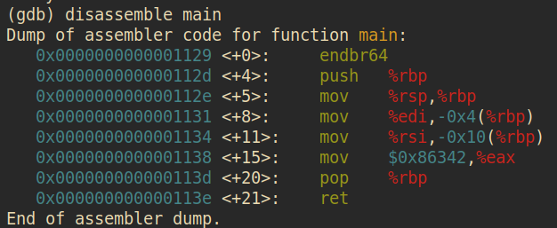

# GDB Baby Step 1 

Description:
Can you figure out what is in the `eax` register at the end of the `main` function? Put your answer in the picoCTF flag format: `picoCTF{n}` where `n` is the contents of the `eax` register in the decimal number base. If the answer was `0x11` your flag would be `picoCTF{17}`.

GDB -> GNU Debugger 

In this challenge I was given a file called `debugger0_a`. 

I found which type of file it was using the `file` command. 

In order to find the `eax` register, I had to first look at the Assembly code of the file. 
I found out using the Internet, that I had to use the built in Linux tool called `gdb` to disassemble the code to return a dump of the assembler code for the function `main`. 

The commands I used for the same are as follows:

```bash
chmod +x debugger0_a # Could not disassemble without root permissions

gdb debugger0_a
```

`gdb` commands:
```text
(gdb) disassemble main 
```

This is how the Assembler code for the function `main` looked like:


On further inspection, I could clearly see what the register for `eax` function contained. 

This is what it contained: 
`$0x86342`

On converting `0x86342` to binary, I got `549698`, which was the answer for the given challenge. 

Final answer: `picoCTF{549698}`

---

# ARMssembly 1 

---
# Vault Door 3

Description: 
This vault uses for-loops and byte arrays. The source code for this vault is here: [VaultDoor3.java](https://jupiter.challenges.picoctf.org/static/a648ca6dd275b9454c5d0de6d0f6efd3/VaultDoor3.java)

VaultDoor3.java: 
```java
import java.util.*;

class VaultDoor3 {
    public static void main(String args[]) {
        VaultDoor3 vaultDoor = new VaultDoor3();
        Scanner scanner = new Scanner(System.in);
        System.out.print("Enter vault password: ");
        String userInput = scanner.next();
	String input = userInput.substring("picoCTF{".length(),userInput.length()-1);
	if (vaultDoor.checkPassword(input)) {
	    System.out.println("Access granted.");
	} else {
	    System.out.println("Access denied!");
        }
    }

    // Our security monitoring team has noticed some intrusions on some of the
    // less secure doors. Dr. Evil has asked me specifically to build a stronger
    // vault door to protect his Doomsday plans. I just *know* this door will
    // keep all of those nosy agents out of our business. Mwa ha!
    //
    // -Minion #2671
    public boolean checkPassword(String password) {
        if (password.length() != 32) {
            return false;
        }
        char[] buffer = new char[32];
        int i;
        for (i=0; i<8; i++) {
            buffer[i] = password.charAt(i);
        }
        for (; i<16; i++) {
            buffer[i] = password.charAt(23-i);
        }
        for (; i<32; i+=2) {
            buffer[i] = password.charAt(46-i);
        }
        for (i=31; i>=17; i-=2) {
            buffer[i] = password.charAt(i);
        }
        String s = new String(buffer);
        return s.equals("jU5t_a_sna_3lpm18gb41_u_4_mfr340");
    }
}

```

solve.py
```python
buff = "jU5t_a_sna_3lpm18gb41_u_4_mfr340"

password = []


for i in range(32):
    password.append("")

for i in range(0, 8):
    password.insert(i, buff[i])
    print(i)

for i in range(8, 16):
    password.insert(i, buff[23-i]) 
    print(23-i)


for i in range(16, 32, 2):
    password.insert(i, buff[46-i])
    print(46-i)
for i in range(31, 16, -2):
    password.insert(i, buff[i])
    print(i)

print(password)

x = "".join(password)

print(x)

```

output: 
```text
0
1
2
3
4
5
6
7
15
14
13
12
11
10
9
8
30
28
26
24
22
20
18
16
31
29
27
25
23
21
19
17
['j', 'U', '5', 't', '_', 'a', '_', 's', '1', 'm', 'p', 'l', '3', '_', 'a', 'n', '4', 'g', '', 'r', '4', '', 'm', '_', '', '4', '_', '', 'u', '_', '', '1', 'f', '', 'b'
, '3', '', '8', '0', '', '', '', '', '', '', '', '', '', '', '', '', '', '', '', '', '', '', '', '', '', '', '', '', '']
jU5t_a_s1mpl3_an4gr4m_4_u_1fb380
```

flag: `picoCTF{jU5t_a_s1mpl3_an4gr4m_4_u_1fb380}`


